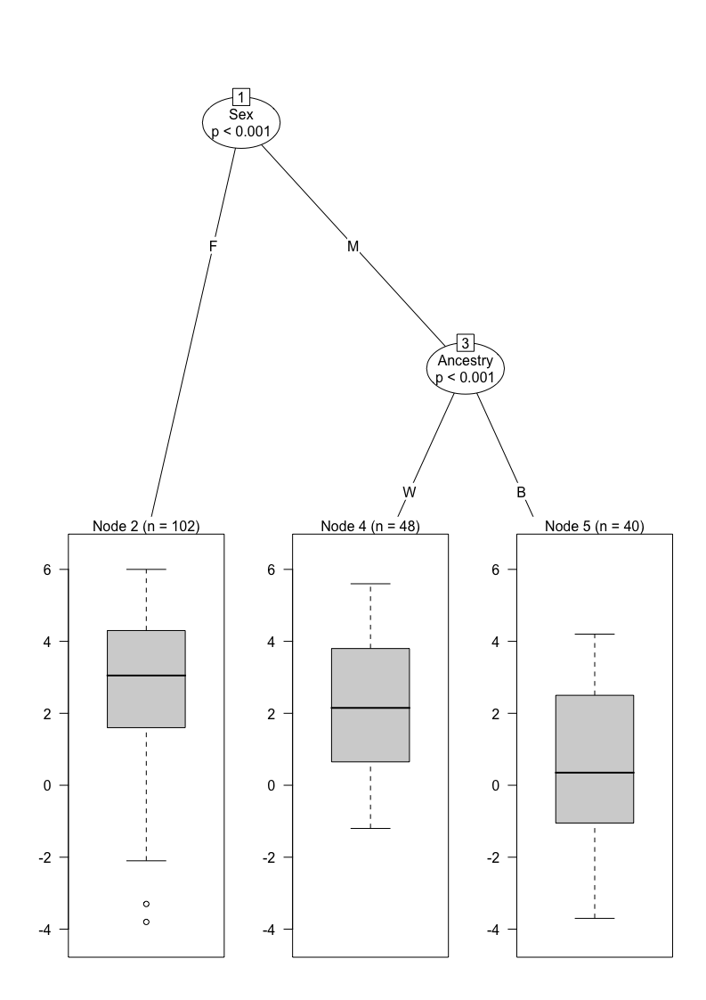
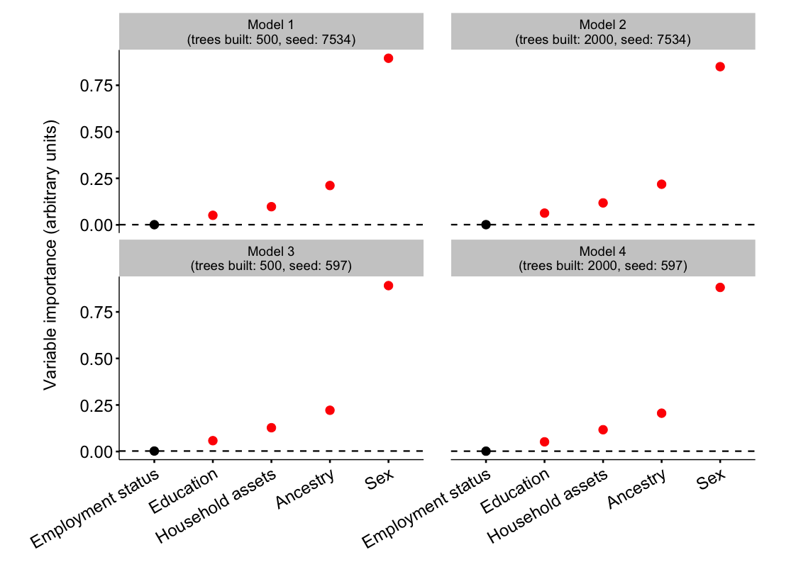

Random forest analysis: Appropriate Pain Behaviours Questionniare (APBQ)-Male
=============================================================================

### Peter Kamerman

**First version: January 28, 2016**

**Latest version: January 29, 2016**

------------------------------------------------------------------------

Session setup
-------------

``` r
# Load packages
library(ggplot2)
library(scales)
library(grid)
library(cowplot)
library(readr)
library(dplyr)
library(tidyr)
library(knitr)
library(party)

# Palette
palette = c('#000000', '#FF0000')

# knitr chunk options
opts_chunk$set(echo = TRUE,
               warning = TRUE,
               message = FALSE,
               cache = TRUE,
               fig.path = './figures/apbq-male/',
               fig.width = 11.69,
               fig.height = 8.27,
               dev = c('png', 'pdf'),
               tidy = TRUE, 
               tidy.opts = list(width.cutoff = 65))
```

Load data
---------

``` r
data <- read_csv("./data/cart-25-01-2016.csv")
```

Quick look
----------

``` r
dim(data)
```

    ## [1] 212  12

``` r
names(data)
```

    ##  [1] "ID"         "CPT"        "PPT"        "Race"       "Sex"       
    ##  [6] "Anxiety"    "Depression" "PCS"        "APBQ-F"     "APBQ-M"    
    ## [11] "Education"  "Assets"

``` r
head(data)
```

    ## Source: local data frame [6 x 12]
    ## 
    ##      ID   CPT   PPT  Race   Sex Anxiety Depression   PCS APBQ-F APBQ-M
    ##   (int) (int) (int) (chr) (chr)   (dbl)      (dbl) (int)  (dbl)  (dbl)
    ## 1     1   217   874     W     M     1.5       1.00    11     NA    1.8
    ## 2     2   300  1154     W     M     2.4       1.53    15     NA    3.0
    ## 3     4    39   741     B     F     2.3       1.60    21    3.6    3.7
    ## 4     5    53  1100     B     F     2.3       1.40    23    0.9    1.5
    ## 5     6   300  1100     B     M     1.3       1.27    13    3.7   -3.1
    ## 6     7   300  1249     W     M     1.4       1.13     3    5.7    3.4
    ## Variables not shown: Education (int), Assets (dbl)

``` r
tail(data)
```

    ## Source: local data frame [6 x 12]
    ## 
    ##      ID   CPT   PPT  Race   Sex Anxiety Depression   PCS APBQ-F APBQ-M
    ##   (int) (int) (int) (chr) (chr)   (dbl)      (dbl) (int)  (dbl)  (dbl)
    ## 1   254   111   664     W     F     1.6       1.80    12    3.5    3.7
    ## 2   255    15   524     B     F     2.2       2.13    NA    3.1    4.3
    ## 3   258   300  1126     B     M     1.2       1.20    NA    0.7   -2.0
    ## 4   259    70  1117     B     F     1.7       2.00     7    5.7    4.5
    ## 5   260    53   892     B     F     1.4         NA    37    4.1    4.9
    ## 6   262    41   471     B     M     1.0       1.27    27    3.8   -3.9
    ## Variables not shown: Education (int), Assets (dbl)

Process data
------------

``` r
# Clean data
data <- data %>% mutate(Race = factor(Race), Sex = factor(Sex), APBQM = `APBQ-M`, 
    Education = factor(Education, ordered = TRUE)) %>% select(-c(1, 
    2, 3, 9:10))
# Complete X and Y variable dataset
data_complete <- data[complete.cases(data), ]
# Length of full dataset (with NAs)
nrow(data)
```

    ## [1] 212

``` r
# Length of complete cases dataset
nrow(data_complete)
```

    ## [1] 167

Simple single tree
------------------

``` r
tree <- ctree(APBQM ~ ., data = data_complete)
plot(tree)
```


 \#\# Random Forest

``` r
# Set random seeds (used sampling on first run only) seed_1 <-
# sample(1:10000, 1); seed_1 seed_2 <- sample(1:10000, 1); seed_2
seed_1 <- 7534
seed_2 <- 597
# Data controls mtry estimated as sqrt of variables
data.control_1 <- cforest_unbiased(ntree = 500, mtry = 3)
data.control_2 <- cforest_unbiased(ntree = 2000, mtry = 3)
# Model 1
set.seed(seed_1)
# ntree = 500, mtry = 3, seed = seed_1 Modelling
model_1 <- cforest(APBQM ~ ., data = data_complete, controls = data.control_1)
model_1_varimp <- varimp(model_1, conditional = TRUE)

# Model 2 ntree = 2000, mtry = 3, seed = seed_1 Modelling
model_2 <- cforest(APBQM ~ ., data = data_complete, controls = data.control_2)
model_2_varimp <- varimp(model_2, conditional = TRUE)

# Model 3 Set seed
set.seed(seed_2)
# ntree = 500, mtry = 3, seed = seed_2 Modelling
model_3 <- cforest(APBQM ~ ., data = data_complete, controls = data.control_1)
model_3_varimp <- varimp(model_3, conditional = TRUE)

# Model 4 ntree = 2000, mtry = 3, seed = seed_2 Modelling
model_4 <- cforest(APBQM ~ ., data = data_complete, controls = data.control_2)
model_4_varimp <- varimp(model_4, conditional = TRUE)
```

Plots
-----

``` r
## Generate plot dataframe
plot_list <- list(model_1_varimp, model_2_varimp, model_3_varimp, 
    model_4_varimp)
plot_list <- lapply(plot_list, function(x) data.frame(Variable = names(x), 
    Importance = x, row.names = NULL))
plot_df <- tbl_df(do.call(cbind, plot_list))
plot_df <- plot_df[, c(1, 2, 4, 6, 8)]
names(plot_df) <- c("Variable", "Model_1", "Model_2", "Model_3", "Model_4")
plot_df <- plot_df %>% gather(Model, Value, -Variable) %>% mutate(Model = factor(Model)) %>% 
    group_by(Model) %>% arrange(desc(Value)) %>% mutate(Important = Value >= 
    abs(min(Value)))
## Dataframe of variable importance thresholds
v_importance <- plot_df %>% summarise(Threshold = abs(min(Value)))
## Vector to order x axis variables
x_order <- rev(plot_df$Variable[1:7])
## Vector to label x variables
x_labs <- c(Depression = "Depression", Education = "Education", PCS = "Catastrophizing", 
    Assets = "Household assets", Anxiety = "Anxiety", Sex = "Sex", 
    Race = "Race")
## Vector of facet labels
f_labels <- c(Model_1 = "Model 1\n(trees built: 500, seed: 7534)", 
    Model_2 = "Model 2\n(trees built: 2000, seed: 7534)", Model_3 = "Model 3\n(trees built: 500, seed: 597)", 
    Model_4 = "Model 4\n(trees built: 2000, seed: 597)")
## Plot
ggplot(data = plot_df, aes(x = Variable, y = Value, colour = Important, 
    fill = Important)) + geom_point(size = 4, shape = 21) + geom_hline(data = v_importance, 
    aes(yintercept = Threshold), linetype = "dashed", size = 0.8) + 
    facet_wrap(~Model, labeller = labeller(Model = f_labels)) + labs(y = "Variable importance (arbitrary units)\n") + 
    scale_x_discrete(labels = x_labs, limits = x_order) + scale_colour_manual(values = palette) + 
    scale_fill_manual(values = palette) + theme(legend.position = "none", 
    plot.margin = unit(c(1, 3, 1, 3), "lines"), panel.margin.x = unit(2, 
        "lines"), axis.title = element_text(size = 18), axis.title.x = element_blank(), 
    axis.text = element_text(size = 18), axis.text.x = element_text(angle = 30, 
        hjust = 1), axis.line = element_line(size = 0.9), axis.ticks = element_line(size = 0.9), 
    strip.text = element_text(size = 14))
```


 \#\# Session information

``` r
sessionInfo()
```

    ## R version 3.2.3 (2015-12-10)
    ## Platform: x86_64-apple-darwin13.4.0 (64-bit)
    ## Running under: OS X 10.11.3 (El Capitan)
    ## 
    ## locale:
    ## [1] en_GB.UTF-8/en_GB.UTF-8/en_GB.UTF-8/C/en_GB.UTF-8/en_GB.UTF-8
    ## 
    ## attached base packages:
    ## [1] stats4    grid      stats     graphics  grDevices utils     datasets 
    ## [8] methods   base     
    ## 
    ## other attached packages:
    ##  [1] party_1.0-25      strucchange_1.5-1 sandwich_2.3-4   
    ##  [4] zoo_1.7-12        modeltools_0.2-21 mvtnorm_1.0-3    
    ##  [7] knitr_1.12        tidyr_0.4.0       dplyr_0.4.3      
    ## [10] readr_0.2.2       cowplot_0.6.0     scales_0.3.0     
    ## [13] ggplot2_2.0.0    
    ## 
    ## loaded via a namespace (and not attached):
    ##  [1] Rcpp_0.12.3      formatR_1.2.1    plyr_1.8.3       tools_3.2.3     
    ##  [5] digest_0.6.9     evaluate_0.8     gtable_0.1.2     lattice_0.20-33 
    ##  [9] DBI_0.3.1        yaml_2.1.13      parallel_3.2.3   coin_1.1-2      
    ## [13] stringr_1.0.0    R6_2.1.1         survival_2.38-3  rmarkdown_0.9.2 
    ## [17] multcomp_1.4-2   TH.data_1.0-6    magrittr_1.5     codetools_0.2-14
    ## [21] htmltools_0.3    splines_3.2.3    assertthat_0.1   colorspace_1.2-6
    ## [25] labeling_0.3     stringi_1.0-1    lazyeval_0.1.10  munsell_0.4.2
