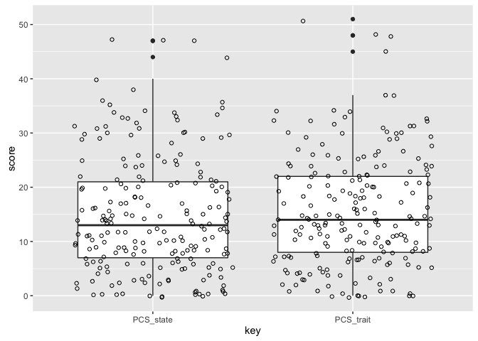
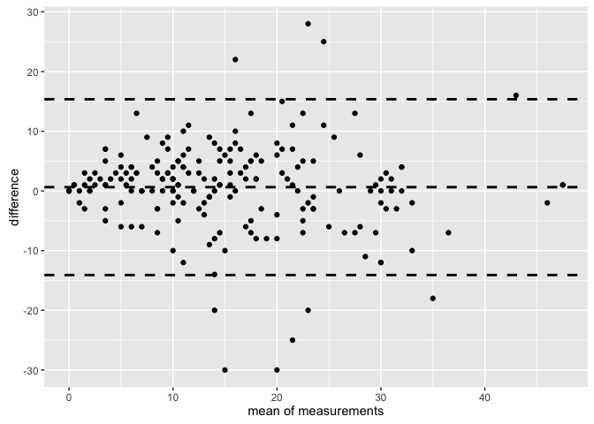
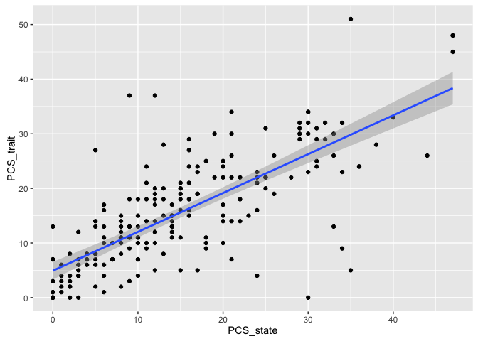

Bland-Altman Limits of Agreement analysis of PCS trait and state values
=======================================================================

### Peter Kamerman

**First version: September 5, 2016**

**Latest version: September 05, 2016**

------------------------------------------------------------------------

Session setup
-------------

``` r
# Load packages
library(BlandAltmanLeh)
library(ggplot2)
library(readr)
library(dplyr)
library(tidyr)

# knitr chunk options
knitr::opts_chunk$set(echo = TRUE,
               warning = FALSE,
               message = FALSE,
               cache = TRUE,
               fig.path = './figures/bland-altman/',
               fig.align = 'center', 
               dev = c('png', 'pdf'),
               tidy = FALSE)
```

Load data
---------

``` r
data <- read_csv('./data/random-forest-2.csv')
```

Quick look
----------

``` r
dim(data)
```

    ## [1] 212  14

``` r
names(data)
```

    ##  [1] "ID"         "CPT"        "PPT"        "Race"       "Sex"       
    ##  [6] "Anxiety"    "Depression" "PCS_trait"  "PCS_state"  "APBQ-F"    
    ## [11] "APBQ-M"     "Education"  "Assets"     "Employment"

``` r
head(data)
```

    ## # A tibble: 6 × 14
    ##      ID   CPT   PPT  Race   Sex Anxiety Depression PCS_trait PCS_state
    ##   <int> <int> <int> <chr> <chr>   <dbl>      <dbl>     <int>     <int>
    ## 1     1   217   874     W     M     1.5       1.00        11        10
    ## 2     2   300  1154     W     M     2.4       1.53        15        20
    ## 3     4    39   741     B     F     2.3       1.60        21        11
    ## 4     5    53  1100     B     F     2.3       1.40        23        24
    ## 5     6   300  1100     B     M     1.3       1.27        13         5
    ## 6     7   300  1249     W     M     1.4       1.13         3         2
    ## # ... with 5 more variables: `APBQ-F` <dbl>, `APBQ-M` <dbl>,
    ## #   Education <int>, Assets <dbl>, Employment <int>

``` r
tail(data)
```

    ## # A tibble: 6 × 14
    ##      ID   CPT   PPT  Race   Sex Anxiety Depression PCS_trait PCS_state
    ##   <int> <int> <int> <chr> <chr>   <dbl>      <dbl>     <int>     <int>
    ## 1   254   111   664     W     F     1.6       1.80        12         8
    ## 2   255    15   524     B     F     2.2       2.13        NA        NA
    ## 3   258   300  1126     B     M     1.2       1.20        NA         8
    ## 4   259    70  1117     B     F     1.7       2.00         7        10
    ## 5   260    53   892     B     F     1.4         NA        37        12
    ## 6   262    41   471     B     M     1.0       1.27        27        NA
    ## # ... with 5 more variables: `APBQ-F` <dbl>, `APBQ-M` <dbl>,
    ## #   Education <int>, Assets <dbl>, Employment <int>

Clean data
----------

``` r
# Select PCS columns
data <- data %>%
    select(ID, PCS_trait, PCS_state)
```

Data analysis
-------------

Descriptive data
----------------

``` r
# Plot
data_long <- data %>%
    gather(key = key, value = score, -ID)

ggplot(data = data_long,
       aes(x = key, y = score)) +
    geom_boxplot() +
    geom_jitter(shape = 21) 
```



``` r
# 5-item summary
summary(data[ , 2:3])
```

    ##    PCS_trait       PCS_state    
    ##  Min.   : 0.00   Min.   : 0.00  
    ##  1st Qu.: 8.00   1st Qu.: 7.00  
    ##  Median :14.00   Median :13.00  
    ##  Mean   :15.62   Mean   :14.99  
    ##  3rd Qu.:22.00   3rd Qu.:21.00  
    ##  Max.   :51.00   Max.   :47.00  
    ##  NA's   :7       NA's   :5

### Bland Altman Limits of Agreement

``` r
# Bland Altman plot
with(data, 
     bland.altman.plot(group1 = PCS_trait, group2 = PCS_state,
                       graph.sys = 'ggplot2'))
```



``` r
# Bland Altman stats
with(data, 
     bland.altman.stats(group1 = PCS_trait, group2 = PCS_state))
```

    ## $means
    ##   [1] 10.5 17.5 16.0 23.5  9.0  2.5 33.0 13.5 36.5 35.0 14.5 11.0 17.0  2.0
    ##  [15] 15.5 15.5  0.5  2.5 13.5  1.5  2.0 23.5 17.5 15.5  9.0 14.0 14.5  3.5
    ##  [29] 22.5 10.5 20.0 21.5 15.5 17.5  1.5 13.5 22.5 28.5  0.0 17.5 22.5 20.0
    ##  [43] 43.0 10.5 14.0 11.0 20.0 19.0  9.5  5.0  0.0 11.0 20.5 30.0 30.0 28.0
    ##  [57] 21.5 16.5 14.0 16.0 14.5 10.0  1.5 23.0 10.0 13.0 17.5 10.5 46.0 33.0
    ##  [71]  9.5  3.5  7.0 31.0  8.0 15.5  1.0 22.5 20.0  7.0 26.5 23.0 15.0  6.0
    ##  [85]  9.5  6.0 15.0 23.5  5.0  9.0 18.0  6.5 25.0  7.0 18.0 30.5 10.0 13.5
    ##  [99] 24.5 47.5 25.5  5.0 12.5  5.5 10.0  4.5  0.0  3.5  0.0  3.5  0.0 11.5
    ## [113]  4.0  3.5 30.5 15.0 22.0  6.0 12.5 18.5 32.0  8.5 14.5 16.5  2.0 10.5
    ## [127]  3.0 21.0  9.0 10.0  8.5 10.0 17.0 20.5 23.0 16.0 47.5 22.5  6.0  6.5
    ## [141] 13.0  8.5  7.0 29.0 11.5 16.0 14.5  5.5 18.0 30.0 26.0 27.5 30.0 10.0
    ## [155] 11.0 29.5 11.0 22.0 18.5 12.0  3.5 14.0 31.0 20.5 14.0 12.0 13.0 29.5
    ## [169] 31.5 13.5 28.0 12.5  0.5  6.5  6.0  5.0 17.0 30.0 23.5 32.0 20.0  7.5
    ## [183]  0.0  8.5 21.5 14.0 11.5  1.0  8.0 32.0 10.5  3.5 21.5 27.5 11.0 18.0
    ## [197]  9.5  5.0 10.0  8.5 24.5
    ## 
    ## $diffs
    ##   [1]   1  -5  10  -1   8   1 -10  -9  -7 -18  -7   4  -6   0   5  -1   1
    ##  [18]   3  -1   3   2  -3  13   1   2   2   1   7  -5   1   6  11   3   5
    ##  [35]  -3   9   5 -11   0   5  -3 -30  16  -1   8 -12  -4  -8   3  -2   0
    ##  [52]  10  15 -12 -12   6   1   7 -14   8   5   2   1  -2 -10  -4  -7   5
    ##  [69]  -2  -2   3  -3   0   0   4   7   0  -7   8   0  -7 -20 -30   4   7
    ##  [86]  -6 -10   5   4   2  -8   3  -6  -6   6  -3   2  -1  11   1   9   2
    ## [103]   5   1  -2   3   0   1   0   1   0   3   2   5   3   6   4   4   3
    ## [120]   5   4   3   1   3   0   5   2   2   0   0  -7   0   4   3  28  22
    ## [137]   1  13   2   3  -2  -3   0   0   7   0   7   3   2  -2   0  -7   0
    ## [154]   2   6  -7   4   0  -3   0   7   0   2   7  -8   0   2   1  -3  -1
    ## [171]  -6  -3   1  13   0   6   2   2  -3   0  -8   9   0   5   7 -20  11
    ## [188]  -2   0   4  -5  -5 -25  13  -2   2   9  -6   4  -3  25
    ## 
    ## $groups
    ##     group1 group2
    ## 1       11     10
    ## 2       15     20
    ## 3       21     11
    ## 4       23     24
    ## 5       13      5
    ## 6        3      2
    ## 7       28     38
    ## 8        9     18
    ## 9       33     40
    ## 10      26     44
    ## 11      11     18
    ## 12      13      9
    ## 13      14     20
    ## 14       2      2
    ## 15      18     13
    ## 16      15     16
    ## 17       1      0
    ## 18       4      1
    ## 19      13     14
    ## 20       3      0
    ## 21       3      1
    ## 22      22     25
    ## 23      24     11
    ## 24      16     15
    ## 25      10      8
    ## 26      15     13
    ## 27      15     14
    ## 28       7      0
    ## 29      20     25
    ## 30      11     10
    ## 31      23     17
    ## 32      27     16
    ## 33      17     14
    ## 34      20     15
    ## 35       0      3
    ## 36      18      9
    ## 37      25     20
    ## 38      23     34
    ## 39       0      0
    ## 40      20     15
    ## 41      21     24
    ## 42       5     35
    ## 43      51     35
    ## 44      10     11
    ## 45      18     10
    ## 46       5     17
    ## 47      18     22
    ## 48      15     23
    ## 50      11      8
    ## 51       4      6
    ## 52       0      0
    ## 53      16      6
    ## 54      28     13
    ## 55      24     36
    ## 56      24     36
    ## 57      31     25
    ## 58      22     21
    ## 59      20     13
    ## 60       7     21
    ## 61      20     12
    ## 62      17     12
    ## 63      11      9
    ## 64       2      1
    ## 65      22     24
    ## 66       5     15
    ## 67      11     15
    ## 68      14     21
    ## 69      13      8
    ## 70      45     47
    ## 71      32     34
    ## 72      11      8
    ## 73       2      5
    ## 74       7      7
    ## 75      31     31
    ## 76      10      6
    ## 77      19     12
    ## 78       1      1
    ## 79      19     26
    ## 80      24     16
    ## 81       7      7
    ## 82      23     30
    ## 83      13     33
    ## 84       0     30
    ## 85       8      4
    ## 86      13      6
    ## 87       3      9
    ## 88      10     20
    ## 89      26     21
    ## 90       7      3
    ## 92      10      8
    ## 93      14     22
    ## 94       8      5
    ## 96      22     28
    ## 97       4     10
    ## 98      21     15
    ## 99      29     32
    ## 100     11      9
    ## 101     13     14
    ## 102     30     19
    ## 103     48     47
    ## 104     30     21
    ## 105      6      4
    ## 106     15     10
    ## 107      6      5
    ## 108      9     11
    ## 109      6      3
    ## 110      0      0
    ## 111      4      3
    ## 112      0      0
    ## 113      4      3
    ## 114      0      0
    ## 115     13     10
    ## 116      5      3
    ## 117      6      1
    ## 118     32     29
    ## 119     18     12
    ## 120     24     20
    ## 121      8      4
    ## 122     14     11
    ## 123     21     16
    ## 124     34     30
    ## 125     10      7
    ## 126     15     14
    ## 127     18     15
    ## 128      2      2
    ## 129     13      8
    ## 130      4      2
    ## 131     22     20
    ## 132      9      9
    ## 133     10     10
    ## 134      5     12
    ## 135     10     10
    ## 136     19     15
    ## 137     22     19
    ## 138     37      9
    ## 139     27      5
    ## 140     48     47
    ## 141     29     16
    ## 142      7      5
    ## 143      8      5
    ## 144     12     14
    ## 145      7     10
    ## 146      7      7
    ## 147     29     29
    ## 148     15      8
    ## 149     16     16
    ## 150     18     11
    ## 151      7      4
    ## 152     19     17
    ## 154     29     31
    ## 155     26     26
    ## 156     24     31
    ## 157     30     30
    ## 158     11      9
    ## 159     14      8
    ## 160     26     33
    ## 161     13      9
    ## 162     22     22
    ## 163     17     20
    ## 164     12     12
    ## 165      7      0
    ## 166     14     14
    ## 167     32     30
    ## 168     24     17
    ## 169     10     18
    ## 170     12     12
    ## 171     14     12
    ## 172     30     29
    ## 173     30     33
    ## 174     13     14
    ## 175     25     31
    ## 176     11     14
    ## 177      1      0
    ## 178     13      0
    ## 179      6      6
    ## 180      8      2
    ## 181     18     16
    ## 182     31     29
    ## 183     22     25
    ## 184     32     32
    ## 186     16     24
    ## 187     12      3
    ## 188      0      0
    ## 189     11      6
    ## 190     25     18
    ## 191      4     24
    ## 192     17      6
    ## 193      0      2
    ## 194      8      8
    ## 196     34     30
    ## 197      8     13
    ## 198      1      6
    ## 199      9     34
    ## 200     34     21
    ## 202     10     12
    ## 203     19     17
    ## 204     14      5
    ## 205      2      8
    ## 207     12      8
    ## 210      7     10
    ## 211     37     12
    ## 
    ## $based.on
    ## [1] 201
    ## 
    ## $lower.limit
    ## [1] -14.09085
    ## 
    ## $mean.diffs
    ## [1] 0.6318408
    ## 
    ## $upper.limit
    ## [1] 15.35453
    ## 
    ## $lines
    ## lower.limit  mean.diffs upper.limit 
    ## -14.0908491   0.6318408  15.3545307 
    ## 
    ## $CI.lines
    ## lower.limit.ci.lower lower.limit.ci.upper   mean.diff.ci.lower 
    ##          -15.9004289          -12.2812693           -0.4129206 
    ##   mean.diff.ci.upper upper.limit.ci.lower upper.limit.ci.upper 
    ##            1.6766022           13.5449509           17.1641105 
    ## 
    ## $two
    ## [1] 1.96
    ## 
    ## $critical.diff
    ## [1] 14.72269

### Linear regression

``` r
# Plot
ggplot(data = data,
       aes(x = PCS_state, y = PCS_trait)) +
    geom_point() +
    geom_smooth(method = 'lm')
```



``` r
with(data,
     cor.test(PCS_trait, PCS_state, method = 'pearson'))
```

    ## 
    ##  Pearson's product-moment correlation
    ## 
    ## data:  PCS_trait and PCS_state
    ## t = 15.999, df = 199, p-value < 2.2e-16
    ## alternative hypothesis: true correlation is not equal to 0
    ## 95 percent confidence interval:
    ##  0.6825348 0.8049166
    ## sample estimates:
    ##       cor 
    ## 0.7500777
