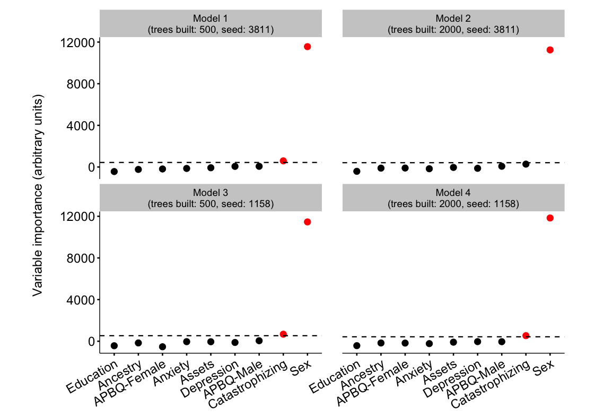

Random forest analysis: Pressure-pain tolerance
===============================================

### Peter Kamerman

**First version: January 29, 2016**

**Latest version: June 25, 2016**

------------------------------------------------------------------------

Session setup
-------------

``` r
# Load packages
library(ggplot2)
library(scales)
library(grid)
library(cowplot)
```

    ## Warning: package 'cowplot' was built under R version 3.2.5

``` r
library(readr)
library(dplyr)
library(tidyr)
library(knitr)
```

    ## Warning: package 'knitr' was built under R version 3.2.5

``` r
library(party)
```

    ## Warning: package 'zoo' was built under R version 3.2.5

``` r
# Palette
palette = c('#000000', '#FF0000')

# knitr chunk options
opts_chunk$set(echo = TRUE,
               warning = TRUE,
               message = FALSE,
               cache = TRUE,
               fig.path = './figures/pressure-pain-tolerance/',
               fig.width = 11.69,
               fig.height = 8.27,
               dev = c('png', 'pdf'),
               tidy = FALSE)
```

Load data
---------

``` r
data <- read_csv('./data/random-forest.csv')
```

Quick look
----------

``` r
dim(data)
```

    ## [1] 212  12

``` r
names(data)
```

    ##  [1] "ID"         "CPT"        "PPT"        "ancestry"   "sex"       
    ##  [6] "anxiety"    "depression" "PCS"        "APBQ-F"     "APBQ-M"    
    ## [11] "education"  "assets"

``` r
head(data)
```

    ## Source: local data frame [6 x 12]
    ## 
    ##      ID   CPT   PPT ancestry   sex anxiety depression   PCS APBQ-F APBQ-M
    ##   (int) (int) (int)    (chr) (chr)   (dbl)      (dbl) (int)  (dbl)  (dbl)
    ## 1     1   217   874      Eur     M     1.5       1.00    11     NA    1.8
    ## 2     2   300  1154      Eur     M     2.4       1.53    15     NA    3.0
    ## 3     4    39   741      Afr     F     2.3       1.60    21    3.6    3.7
    ## 4     5    53  1100      Afr     F     2.3       1.40    23    0.9    1.5
    ## 5     6   300  1100      Afr     M     1.3       1.27    13    3.7   -3.1
    ## 6     7   300  1249      Eur     M     1.4       1.13     3    5.7    3.4
    ## Variables not shown: education (int), assets (dbl)

``` r
tail(data)
```

    ## Source: local data frame [6 x 12]
    ## 
    ##      ID   CPT   PPT ancestry   sex anxiety depression   PCS APBQ-F APBQ-M
    ##   (int) (int) (int)    (chr) (chr)   (dbl)      (dbl) (int)  (dbl)  (dbl)
    ## 1   254   111   664      Eur     F     1.6       1.80    12    3.5    3.7
    ## 2   255    15   524      Afr     F     2.2       2.13    NA    3.1    4.3
    ## 3   258   300  1126      Afr     M     1.2       1.20    NA    0.7   -2.0
    ## 4   259    70  1117      Afr     F     1.7       2.00     7    5.7    4.5
    ## 5   260    53   892      Afr     F     1.4         NA    37    4.1    4.9
    ## 6   262    41   471      Afr     M     1.0       1.27    27    3.8   -3.9
    ## Variables not shown: education (int), assets (dbl)

Process data
------------

``` r
# Clean data
data <- data %>%
    mutate(Ancestry = factor(ancestry),
           Sex = factor(sex),
           Anxiety = anxiety,
           Depression = depression,
           APBQF = `APBQ-F`,
           APBQM = `APBQ-M`,
           Education = factor(education, ordered = TRUE),
           Assets = assets) %>%
    select(-c(1, 2, 4:7, 9:12))
# Complete X and Y variable dataset
data_complete <- data[complete.cases(data), ] 
# Length of full dataset (with NAs)
nrow(data)
```

    ## [1] 212

``` r
# Length of complete cases dataset
nrow(data_complete)
```

    ## [1] 156

``` r
glimpse(data_complete)
```

    ## Observations: 156
    ## Variables: 10
    ## $ PPT        (int) 741, 1100, 1100, 1249, 628, 1080, 908, 538, 580, 43...
    ## $ PCS        (int) 21, 23, 13, 3, 28, 9, 26, 11, 13, 14, 2, 18, 15, 1,...
    ## $ Ancestry   (fctr) Afr, Afr, Afr, Eur, Eur, Eur, Eur, Eur, Eur, Eur, ...
    ## $ Sex        (fctr) F, F, M, M, F, M, M, F, M, M, F, F, F, M, F, F, F,...
    ## $ Anxiety    (dbl) 2.3, 2.3, 1.3, 1.4, 2.3, 1.3, 1.7, 1.5, 1.2, 1.3, 1...
    ## $ Depression (dbl) 1.60, 1.40, 1.27, 1.13, 2.60, 1.53, 1.40, 1.27, 1.2...
    ## $ APBQF      (dbl) 3.6, 0.9, 3.7, 5.7, 6.0, 4.9, 6.0, 3.4, 4.8, 4.7, 0...
    ## $ APBQM      (dbl) 3.7, 1.5, -3.1, 3.4, 5.2, 3.7, 5.5, 3.0, 2.2, 4.7, ...
    ## $ Education  (fctr) 3, 3, 3, 3, 3, 3, 2, 3, 3, 3, 3, 3, 2, 3, 3, 3, 3,...
    ## $ Assets     (dbl) 1.0, 1.0, 0.6, 1.0, 1.0, 1.0, 1.0, 1.0, 1.0, 1.0, 1...

Simple single tree
------------------

``` r
tree <- ctree(PPT ~ ., data = data_complete)
plot(tree)
```


Random Forest
-------------

``` r
# Set random seeds (used sampling on first run only)
# seed_1 <- sample(1:10000, 1); seed_1
# seed_2 <- sample(1:10000, 1); seed_2
seed_1 <- 3811
seed_2 <- 1158
# Data controls
## mtry estimated as sqrt of variables 
data.control_1 <- cforest_unbiased(ntree = 500, mtry = 3) 
data.control_2 <- cforest_unbiased(ntree = 2000, mtry = 3) 
# Model 1
#########
set.seed(seed_1)
# ntree = 500, mtry = 3, seed = seed_1
# Modelling 
model_1 <- cforest(PPT ~ .,
                    data = data_complete,
                    controls = data.control_1) 
model_1_varimp <- varimp(model_1, conditional = TRUE)

# Model 2
#########
# ntree = 2000, mtry = 3, seed = seed_1
# Modelling 
model_2 <- cforest(PPT ~ .,
                    data = data_complete,
                    controls = data.control_2) 
model_2_varimp <- varimp(model_2, conditional = TRUE)

# Model 3
#########
# Set seed
set.seed(seed_2)
# ntree = 500, mtry = 3, seed = seed_2
# Modelling 
model_3 <- cforest(PPT ~ .,
                    data = data_complete,
                    controls = data.control_1) 
model_3_varimp <- varimp(model_3, conditional = TRUE)

# Model 4
#########
# ntree = 2000, mtry = 3, seed = seed_2
# Modelling 
model_4 <- cforest(PPT ~ .,
                    data = data_complete,
                    controls = data.control_2) 
model_4_varimp <- varimp(model_4, conditional = TRUE)
```

Plots
-----

``` r
## Generate plot dataframe
plot_list <- list(model_1_varimp, model_2_varimp, 
                  model_3_varimp, model_4_varimp)
plot_list <- lapply(plot_list, function(x)
    data.frame(Variable = names(x), Importance = x, row.names = NULL))
plot_df <- tbl_df(do.call(cbind, plot_list))
plot_df <- plot_df[ , c(1, 2, 4, 6, 8)]
names(plot_df) <- c('Variable', 'Model_1', 'Model_2', 'Model_3', 'Model_4')
plot_df <- plot_df %>%
    gather(Model, Value, -Variable) %>%
    mutate(Model = factor(Model)) %>%
    group_by(Model) %>%
    arrange(desc(Value)) %>%
    mutate(Important = Value >= abs(min(Value)))
## Dataframe of variable importance thresholds
v_importance <- plot_df %>%
    summarise(Threshold = abs(min(Value)))
## Vector to order x axis variables
x_order <- rev(plot_df$Variable[1:9])
## Vector to label x variables
x_labs <- c(APBQF = 'APBQ-Female',
            depression = 'Depression',
            education = 'Education',
            APBQM = 'APBQ-Male',
            PCS = 'Catastrophizing',
            assets = 'Household assets',
            anxiety = 'Anxiety',
            sex = 'Sex',
            race = 'Race')
## Vector of facet labels
f_labels <- c(Model_1 = 'Model 1\n(trees built: 500, seed: 3811)',
              Model_2 = 'Model 2\n(trees built: 2000, seed: 3811)',
              Model_3 = 'Model 3\n(trees built: 500, seed: 1158)',
              Model_4 = 'Model 4\n(trees built: 2000, seed: 1158)')
## Plot
ggplot(data = plot_df, aes(
                  x = Variable,
                  y = Value,
                  colour = Important,
                  fill = Important)) +
    geom_point(size = 4, 
               shape = 21) +
    geom_hline(data = v_importance, 
               aes(yintercept = Threshold), 
               linetype = 'dashed',
               size = 0.8) +
    facet_wrap(~ Model, 
               labeller = labeller(Model = f_labels)) +
    labs(y = 'Variable importance (arbitrary units)\n') +
    scale_x_discrete(labels = x_labs,
                     limits = x_order) +
    scale_colour_manual(values = palette) +
    scale_fill_manual(values = palette) +
    theme(legend.position = 'none',
          plot.margin = unit(c(1, 3, 1, 3), 'lines'),
          panel.margin.x = unit(2, 'lines'),
          axis.title = element_text(size = 18),
          axis.title.x = element_blank(),
          axis.text = element_text(size = 18),
          axis.text.x = element_text(angle = 30, hjust = 1),
          axis.line = element_line(size = 0.9),
          axis.ticks = element_line(size = 0.9),
          strip.text = element_text(size = 14))
```



Session information
-------------------

``` r
sessionInfo()
```

    ## R version 3.2.4 (2016-03-10)
    ## Platform: x86_64-apple-darwin13.4.0 (64-bit)
    ## Running under: OS X 10.11.5 (El Capitan)
    ## 
    ## locale:
    ## [1] en_GB.UTF-8/en_GB.UTF-8/en_GB.UTF-8/C/en_GB.UTF-8/en_GB.UTF-8
    ## 
    ## attached base packages:
    ## [1] stats4    grid      stats     graphics  grDevices utils     datasets 
    ## [8] methods   base     
    ## 
    ## other attached packages:
    ##  [1] party_1.0-25      strucchange_1.5-1 sandwich_2.3-4   
    ##  [4] zoo_1.7-13        modeltools_0.2-21 mvtnorm_1.0-5    
    ##  [7] knitr_1.13        tidyr_0.4.1       dplyr_0.4.3      
    ## [10] readr_0.2.2       cowplot_0.6.2     scales_0.4.0     
    ## [13] ggplot2_2.1.0    
    ## 
    ## loaded via a namespace (and not attached):
    ##  [1] Rcpp_0.12.4      formatR_1.4      plyr_1.8.3       tools_3.2.4     
    ##  [5] digest_0.6.9     evaluate_0.9     gtable_0.2.0     lattice_0.20-33 
    ##  [9] Matrix_1.2-6     DBI_0.4          yaml_2.1.13      parallel_3.2.4  
    ## [13] coin_1.1-2       stringr_1.0.0    R6_2.1.2         survival_2.39-3 
    ## [17] rmarkdown_0.9.6  multcomp_1.4-5   TH.data_1.0-7    magrittr_1.5    
    ## [21] codetools_0.2-14 htmltools_0.3.5  splines_3.2.4    MASS_7.3-45     
    ## [25] assertthat_0.1   colorspace_1.2-6 labeling_0.3     stringi_1.0-1   
    ## [29] lazyeval_0.1.10  munsell_0.4.3
