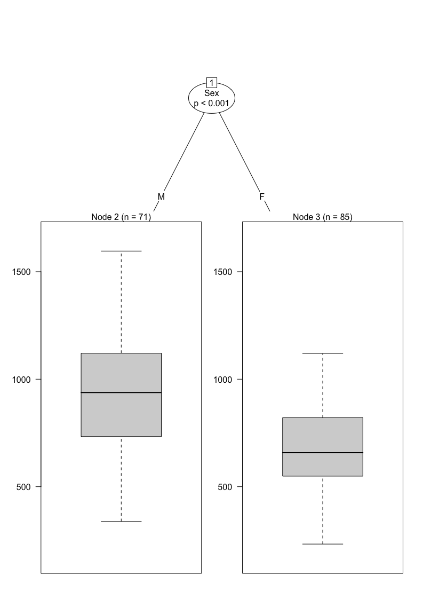
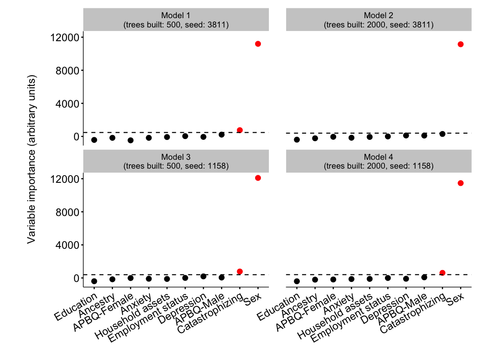

Random forest analysis: Pressure-pain tolerance
===============================================

### Peter Kamerman

**First version: January 29, 2016**

**Latest version: September 05, 2016**

------------------------------------------------------------------------

Session setup
-------------

``` r
# Load packages
library(ggplot2)
library(scales)
library(grid)
library(cowplot)
```

    ## Warning: package 'cowplot' was built under R version 3.2.5

``` r
library(readr)
```

    ## Warning: package 'readr' was built under R version 3.2.5

``` r
library(dplyr)
```

    ## Warning: package 'dplyr' was built under R version 3.2.5

``` r
library(tidyr)
```

    ## Warning: package 'tidyr' was built under R version 3.2.5

``` r
library(knitr)
```

    ## Warning: package 'knitr' was built under R version 3.2.5

``` r
library(party)
```

    ## Warning: package 'zoo' was built under R version 3.2.5

``` r
# Palette
palette = c('#000000', '#FF0000')

# knitr chunk options
opts_chunk$set(echo = TRUE,
               warning = TRUE,
               message = FALSE,
               cache = TRUE,
               fig.path = './figures/pressure-pain-tolerance/',
               fig.width = 11.69,
               fig.height = 8.27,
               dev = c('png', 'pdf'),
               tidy = FALSE)
```

Load data
---------

``` r
data <- read_csv('./data/random-forest.csv')
```

Quick look
----------

``` r
dim(data)
```

    ## [1] 212  14

``` r
names(data)
```

    ##  [1] "ID"         "CPT"        "PPT"        "Race"       "Sex"       
    ##  [6] "Anxiety"    "Depression" "PCS_trait"  "PCS_state"  "APBQ-F"    
    ## [11] "APBQ-M"     "Education"  "Assets"     "Employment"

``` r
head(data)
```

    ## # A tibble: 6 × 14
    ##      ID   CPT   PPT  Race   Sex Anxiety Depression PCS_trait PCS_state
    ##   <int> <int> <int> <chr> <chr>   <dbl>      <dbl>     <int>     <int>
    ## 1     1   217   874     W     M     1.5       1.00        11        10
    ## 2     2   300  1154     W     M     2.4       1.53        15        20
    ## 3     4    39   741     B     F     2.3       1.60        21        11
    ## 4     5    53  1100     B     F     2.3       1.40        23        24
    ## 5     6   300  1100     B     M     1.3       1.27        13         5
    ## 6     7   300  1249     W     M     1.4       1.13         3         2
    ## # ... with 5 more variables: `APBQ-F` <dbl>, `APBQ-M` <dbl>,
    ## #   Education <int>, Assets <dbl>, Employment <int>

``` r
tail(data)
```

    ## # A tibble: 6 × 14
    ##      ID   CPT   PPT  Race   Sex Anxiety Depression PCS_trait PCS_state
    ##   <int> <int> <int> <chr> <chr>   <dbl>      <dbl>     <int>     <int>
    ## 1   254   111   664     W     F     1.6       1.80        12         8
    ## 2   255    15   524     B     F     2.2       2.13        NA        NA
    ## 3   258   300  1126     B     M     1.2       1.20        NA         8
    ## 4   259    70  1117     B     F     1.7       2.00         7        10
    ## 5   260    53   892     B     F     1.4         NA        37        12
    ## 6   262    41   471     B     M     1.0       1.27        27        NA
    ## # ... with 5 more variables: `APBQ-F` <dbl>, `APBQ-M` <dbl>,
    ## #   Education <int>, Assets <dbl>, Employment <int>

Process data
------------

``` r
# Clean data
data <- data %>%
    mutate(Ancestry = factor(Race),
           Sex = factor(Sex),
           APBQF = `APBQ-F`,
           APBQM = `APBQ-M`,
           Education = factor(Education, ordered = TRUE)) %>%
    select(-c(ID, CPT, Race, PCS_state, `APBQ-F`, `APBQ-M`))
# Complete X and Y variable dataset
data_complete <- data[complete.cases(data), ] 
# Length of full dataset (with NAs)
nrow(data)
```

    ## [1] 212

``` r
# Length of complete cases dataset
nrow(data_complete)
```

    ## [1] 156

``` r
glimpse(data_complete)
```

    ## Observations: 156
    ## Variables: 11
    ## $ PPT        <int> 741, 1100, 1100, 1249, 628, 1080, 908, 538, 580, 43...
    ## $ Sex        <fctr> F, F, M, M, F, M, M, F, M, M, F, F, F, M, F, F, F,...
    ## $ Anxiety    <dbl> 2.3, 2.3, 1.3, 1.4, 2.3, 1.3, 1.7, 1.5, 1.2, 1.3, 1...
    ## $ Depression <dbl> 1.60, 1.40, 1.27, 1.13, 2.60, 1.53, 1.40, 1.27, 1.2...
    ## $ PCS_trait  <int> 21, 23, 13, 3, 28, 9, 26, 11, 13, 14, 2, 18, 15, 1,...
    ## $ Education  <ord> 3, 3, 3, 3, 3, 3, 2, 3, 3, 3, 3, 3, 2, 3, 3, 3, 3, ...
    ## $ Assets     <dbl> 1.0, 1.0, 0.6, 1.0, 1.0, 1.0, 1.0, 1.0, 1.0, 1.0, 1...
    ## $ Employment <int> 1, 1, 1, 1, 1, 1, 1, 1, 1, 1, 1, 1, 1, 1, 1, 1, 1, ...
    ## $ Ancestry   <fctr> B, B, B, W, W, W, W, W, W, W, W, W, W, W, W, W, B,...
    ## $ APBQF      <dbl> 3.6, 0.9, 3.7, 5.7, 6.0, 4.9, 6.0, 3.4, 4.8, 4.7, 0...
    ## $ APBQM      <dbl> 3.7, 1.5, -3.1, 3.4, 5.2, 3.7, 5.5, 3.0, 2.2, 4.7, ...

Simple single tree
------------------

``` r
tree <- ctree(PPT ~ ., data = data_complete)
plot(tree)
```



Random Forest
-------------

``` r
# Set random seeds (used sampling on first run only)
# seed_1 <- sample(1:10000, 1); seed_1
# seed_2 <- sample(1:10000, 1); seed_2
seed_1 <- 3811
seed_2 <- 1158
# Data controls
## mtry estimated as sqrt of variables 
data.control_1 <- cforest_unbiased(ntree = 500, mtry = 3) 
data.control_2 <- cforest_unbiased(ntree = 2000, mtry = 3) 
# Model 1
#########
set.seed(seed_1)
# ntree = 500, mtry = 3, seed = seed_1
# Modelling 
model_1 <- cforest(PPT ~ .,
                    data = data_complete,
                    controls = data.control_1) 
model_1_varimp <- varimp(model_1, conditional = TRUE)

# Model 2
#########
# ntree = 2000, mtry = 3, seed = seed_1
# Modelling 
model_2 <- cforest(PPT ~ .,
                    data = data_complete,
                    controls = data.control_2) 
model_2_varimp <- varimp(model_2, conditional = TRUE)

# Model 3
#########
# Set seed
set.seed(seed_2)
# ntree = 500, mtry = 3, seed = seed_2
# Modelling 
model_3 <- cforest(PPT ~ .,
                    data = data_complete,
                    controls = data.control_1) 
model_3_varimp <- varimp(model_3, conditional = TRUE)

# Model 4
#########
# ntree = 2000, mtry = 3, seed = seed_2
# Modelling 
model_4 <- cforest(PPT ~ .,
                    data = data_complete,
                    controls = data.control_2) 
model_4_varimp <- varimp(model_4, conditional = TRUE)
```

Plots
-----

``` r
## Generate plot dataframe
plot_list <- list(model_1_varimp, model_2_varimp, 
                  model_3_varimp, model_4_varimp)
plot_list <- lapply(plot_list, function(x)
    data.frame(Variable = names(x), Importance = x, row.names = NULL))
plot_df <- do.call(cbind, plot_list)
plot_df <- plot_df[ , c(1, 2, 4, 6, 8)]
names(plot_df) <- c('Variable', 'Model_1', 'Model_2', 'Model_3', 'Model_4')
plot_df <- plot_df %>%
    gather(Model, Value, -Variable) %>%
    mutate(Model = factor(Model)) %>%
    group_by(Model) %>%
    arrange(desc(Value)) %>%
    mutate(Important = Value > abs(min(Value)))
## Dataframe of variable importance thresholds
v_importance <- plot_df %>%
    summarise(Threshold = abs(min(Value)))
## Vector to label x variables
x_labs <- c(APBQF = 'APBQ-Female',
            Depression = 'Depression',
            Education = 'Education',
            APBQM = 'APBQ-Male',
            PCS_trait = 'Catastrophizing',
            Assets = 'Household assets',
            Anxiety = 'Anxiety',
            Sex = 'Sex',
            Ancestry = 'Ancestry',
            Employment = 'Employment status')
## Vector to order x axis variables
x_order <- plot_df %>%
    group_by(Variable) %>%
    summarise(mean = mean(Value)) %>%
    arrange(mean) %>%
    mutate(Variable = factor(Variable, Variable, ordered = TRUE)) 
x_order <- x_order$Variable
## Vector of facet labels
f_labels <- c(Model_1 = 'Model 1\n(trees built: 500, seed: 3811)',
              Model_2 = 'Model 2\n(trees built: 2000, seed: 3811)',
              Model_3 = 'Model 3\n(trees built: 500, seed: 1158)',
              Model_4 = 'Model 4\n(trees built: 2000, seed: 1158)')
## Plot
ggplot(data = plot_df, aes(
                  x = Variable,
                  y = Value,
                  colour = Important,
                  fill = Important)) +
    geom_point(size = 4, 
               shape = 21) +
    geom_hline(data = v_importance, 
               aes(yintercept = Threshold), 
               linetype = 'dashed',
               size = 0.8) +
    facet_wrap(~ Model, 
               labeller = labeller(Model = f_labels)) +
    labs(y = 'Variable importance (arbitrary units)\n') +
    scale_x_discrete(labels = x_labs,
                     limits = x_order) +
    scale_colour_manual(values = palette) +
    scale_fill_manual(values = palette) +
    theme(legend.position = 'none',
          plot.margin = unit(c(1, 3, 1, 3), 'lines'),
          panel.margin.x = unit(2, 'lines'),
          axis.title = element_text(size = 18),
          axis.title.x = element_blank(),
          axis.text = element_text(size = 18),
          axis.text.x = element_text(angle = 30, hjust = 1),
          axis.line = element_line(size = 0.9),
          axis.ticks = element_line(size = 0.9),
          strip.text = element_text(size = 14))
```



Session information
-------------------

``` r
sessionInfo()
```

    ## R version 3.2.4 (2016-03-10)
    ## Platform: x86_64-apple-darwin13.4.0 (64-bit)
    ## Running under: OS X 10.11.6 (El Capitan)
    ## 
    ## locale:
    ## [1] en_GB.UTF-8/en_GB.UTF-8/en_GB.UTF-8/C/en_GB.UTF-8/en_GB.UTF-8
    ## 
    ## attached base packages:
    ## [1] stats4    grid      stats     graphics  grDevices utils     datasets 
    ## [8] methods   base     
    ## 
    ## other attached packages:
    ##  [1] party_1.0-25      strucchange_1.5-1 sandwich_2.3-4   
    ##  [4] zoo_1.7-13        modeltools_0.2-21 mvtnorm_1.0-5    
    ##  [7] knitr_1.14        tidyr_0.6.0       dplyr_0.5.0      
    ## [10] readr_1.0.0       cowplot_0.6.2     scales_0.4.0     
    ## [13] ggplot2_2.1.0    
    ## 
    ## loaded via a namespace (and not attached):
    ##  [1] Rcpp_0.12.6      formatR_1.4      plyr_1.8.4       tools_3.2.4     
    ##  [5] digest_0.6.10    evaluate_0.9     tibble_1.2       gtable_0.2.0    
    ##  [9] lattice_0.20-33  Matrix_1.2-6     DBI_0.5          yaml_2.1.13     
    ## [13] coin_1.1-2       stringr_1.1.0    R6_2.1.3         survival_2.39-5 
    ## [17] rmarkdown_1.0    multcomp_1.4-6   TH.data_1.0-7    magrittr_1.5    
    ## [21] codetools_0.2-14 htmltools_0.3.5  splines_3.2.4    MASS_7.3-45     
    ## [25] assertthat_0.1   colorspace_1.2-6 labeling_0.3     stringi_1.1.1   
    ## [29] lazyeval_0.2.0   munsell_0.4.3
